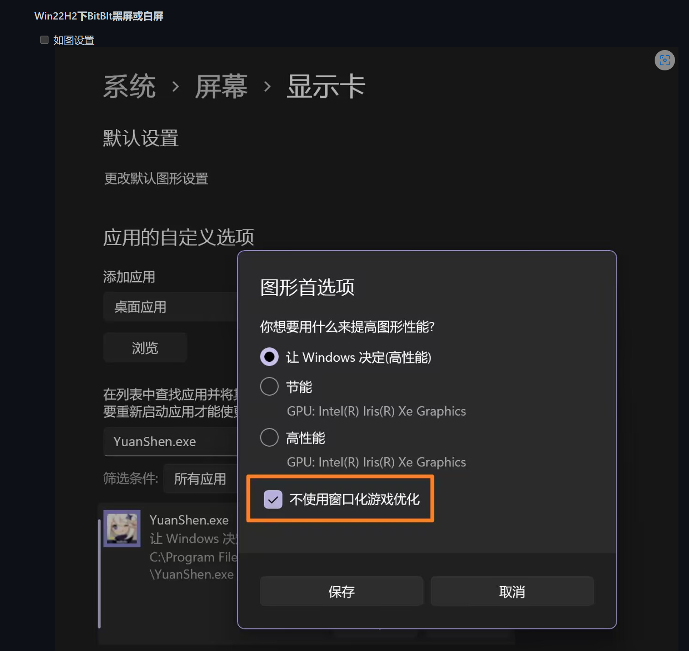

# FAQ

## Windows11 related

如果你正在使用Windows11，请按如下设置。

## 注意以下配置

### Config configuration

Before use, these configuration elements shoule be noted:

| 位置                        | 配置项             | 内容                                                     |
| --------------------------- | ------------------ | -------------------------------------------------------- |
| config/settings/config.json | `BorderlessWindow` | When using boradless window or full screen, set to true. |

### Genshin window settings

- Need to run GIA after the Genshin Impact starts.
- 原神需要以1080p窗口化运行（全屏也可以），设置抗锯齿为SMAA，中或以上特效，开启动态模糊。
- The focus of windows shoule be on Genshin window. If the focus window is switched to another window, the program will pause all the operation of keyboard and mouse and wait.

### Progress in Genshin

- You need to unlock region map of `The Chasm: Underground Mines` first.
- 需要解锁璃月与蒙德的大部分传送锚点，**副本式**秘境。

## Not working

Q: Program crashed?

- Check if the file path is fully English or underscored.
- Check if the submodule is successfully cloned.
- If prompted with `No module name win32gui`, please restart GIA Launcher.

Q: What should I do if I get stuck with a lot of text popping up after launching GIA Launcher?

- It is pip copying files, if no error is reported, just wait.
- Notice if the **Select: GIA Launcher** words `Select` appear in the window. If it appears, press enter to continue the program. The base of GIA Launcher is a bat file and will pause when you click on the command window, so do no click on the command line interface.

## Runtime issues

Q: No response?

- If you opened Genshin Launcher before GIA, try restarting GIA.
- Check if the start button is clicked more than once.

Q: It shows "ERROR: Screenshot failed". What should I do?

- If `shape=0,0,4`, pls confirm your Genshin Window not minimized.
- If shape=xxx,xxx,4, please make sure that the Genshin window resolution is 1080p and that the Genshin launcher window is closed.

Q: What if I set up a strategy during battle but do not switch to a character whose Q skill is already ready?

- Check if the effets are medium or above.

Q: What should I do if I always point crookedly in the big map?

- See if the `pre-use configuration` in the readme is set.
- Currently, support for teleporting to the weekly style domain and the Inazuma is not yet complete. It will be adapted in the future.
