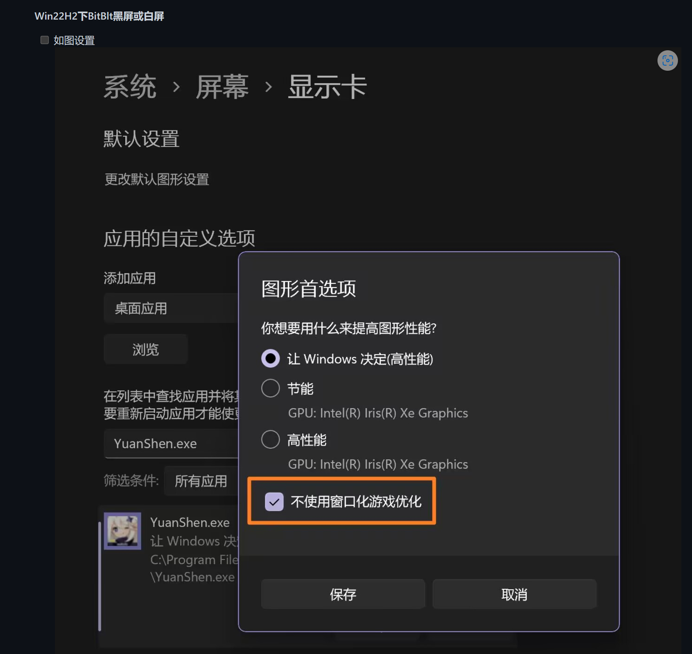

# Quick Start

0. See [GIA Launcher Auto Installer Tutorial](install.md).
1. 打开原神，设置分辨率1080p，关掉原神启动器，传送到追忆本秘境，然后进入秘境；
2. 打开GIA Launcher.exe，等待弹出主界面；
3. 选择网页GUI中的秘境任务，打钩，点击 `开始/启动Task` 旁边的按钮；
4. 把窗口切换到原神，双手离开键盘。

- 注意：你的队伍角色最好在`阿贝多、班尼特、凝光、宵宫、云堇、钟离、甘雨、夜兰、神里绫华、迪奥娜、香菱、申鹤、枫原万叶、雷电将军、胡桃、莫娜、七七、刻晴、珊瑚宫心海、纳西妲`之中。
- 多显示器适配非常混乱，如果截图失败试试单显示器。
- 如果你正在使用Windows11，请按如下设置。

# Caution

### Config configuration

Before use, these configuration elements shoule be noted:

| name                        | configuration      | content                                                  |
| --------------------------- | ------------------ | -------------------------------------------------------- |
| config/settings/config.json | `BorderlessWindow` | When using boradless window or full screen, set to true. |

### Genshin window settings

- Need to run GIA after the Genshin Impact starts.
- The Genshin needs to run in 1080p window (full screen is also possible), set anti-aliasing to SMAA, effects to meduim or above.
- The focus of windows shoule be on Genshin window. If the focus window is switched to another window, the program will pause all the operation of keyboard and mouse and wait.

### Progress in Genshin

- You need to unlock region map of `The Chasm: Underground Mines` first.
- 需要解锁璃月与蒙德的大部分传送锚点，**副本式**秘境。
